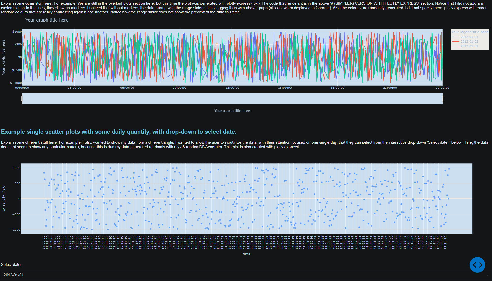

# **dash-template**
a simple dash analytical app template to make basic data analyses reporting more interactive

## TODO
- Content of the README
- Handling `__pycache__` at each Dash app execution...

### Preview 1 - top of the app

### Preview 2 - bottom of the app
